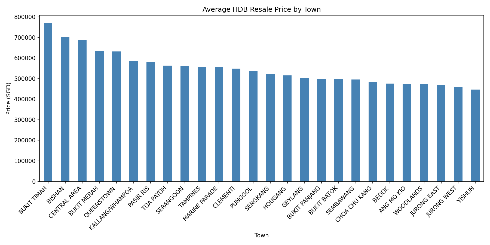
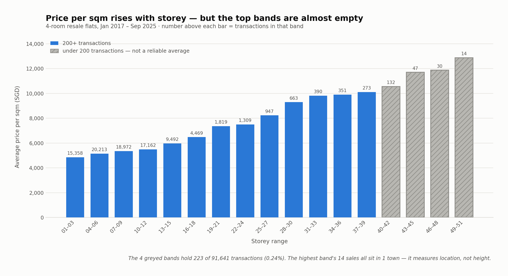

## Singapore HDB Resale Price Analysis

### Overview

This project analyses 216,375 HDB resale transactions in Singapore from January 2017 to September 2025, using Python to explore the factors that move public housing prices — and to check which of those factors survive scrutiny.

### Technical Implementation
* ****Language****: Python
* ****Libraries****: pandas (data manipulation), matplotlib (visualisation)
* ****Tools****: Jupyter Notebook, Power BI

### Problem Statement
HDB resale prices vary widely by location, floor level and flat type.
This project addresses three questions:

1. Which towns have the highest and lowest average resale prices?
2. How much does floor level actually affect price?
3. Which areas offer the best value in terms of price per square metre?

### Data & Methodology

* ****Data source****: Singapore Government Open Data (data.gov.sg)
* ****Dataset****: HDB resale transactions, Jan 2017 – Sep 2025, 216,375 records

* ****Methodology****:
  1. Cleaned the dataset and ran exploratory data analysis in pandas.
  2. Calculated and visualised average prices by town, flat type and storey range with matplotlib.
  3. Engineered a `price_per_sqm` metric to compare value across towns of differing flat sizes.
  4. Checked each headline comparison against its sample size before reporting it.
  5. Summarised the results in a Power BI dashboard.

### Key Findings

* ****Regional price disparity****: Bukit Timah is the most expensive town at an average of $769K, 72% above Yishun ($447K), the cheapest.
* ****Floor premium — smaller than the raw numbers suggest****: Among 4-room flats, average price per sqm rises from $4,852/sqm at storeys 01–03 to $10,106/sqm at storeys 37–39. Bands above the 40th storey are **excluded from this comparison**: they hold 223 of 91,641 4-room transactions (0.24%), and the highest band's 14 sales all sit in a single town. Those bands measure location, not height. *(The figures above are not yet controlled for town or flat age — see Limitations.)*
* ****Highest price per sqm****: The Central Area commands $8,166/sqm, followed by Queenstown ($7,497/sqm) and Bukit Merah ($7,191/sqm).
* ****Highest-priced transaction****: A 5-room Premium Apartment Loft in Queenstown, sold for $1.66M in June 2025.

### Limitations

The comparisons above are unadjusted averages. Town, flat type, flat age and transaction year are correlated with one another, so a difference attributed to one of them may belong to another — the storey figures are the clearest example. A follow-up analysis controlling for these variables is in progress and will replace the headline figures above.

### Visualisations





The results are also assembled in a Power BI dashboard (`SG_HDB_RESALE.pbix` in this repository). GitHub cannot render `.pbix` files, so the images above are the readable version.

### Repository Structure

```
singapore-hdb-analysis/
├── Singapore_HDB_Analysis.ipynb                                  # Main analysis notebook
├── ResaleflatpricesbasedonregistrationdatefromJan2017onwards.csv # Dataset
├── images/                                                       # Charts
├── SG_HDB_RESALE.pbix                                            # Power BI file
└── README.md                                                     # Documentation
```

### How to Run

```bash
# 1. Clone the repository
git clone https://github.com/JinWanKim98/singapore-hdb-analysis.git
cd singapore-hdb-analysis

# 2. Install dependencies
pip install pandas matplotlib jupyter

# 3. Run the notebook
jupyter notebook Singapore_HDB_Analysis.ipynb
```
