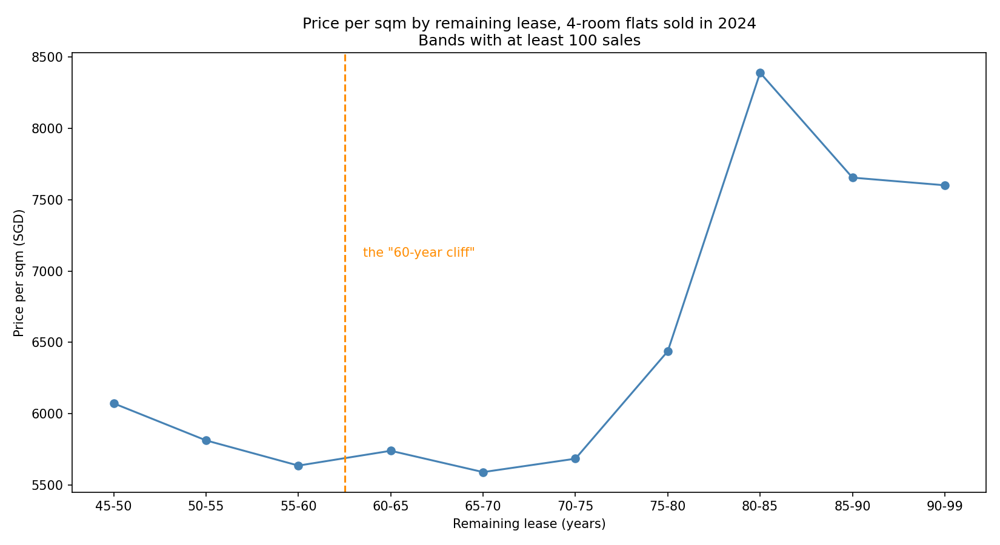
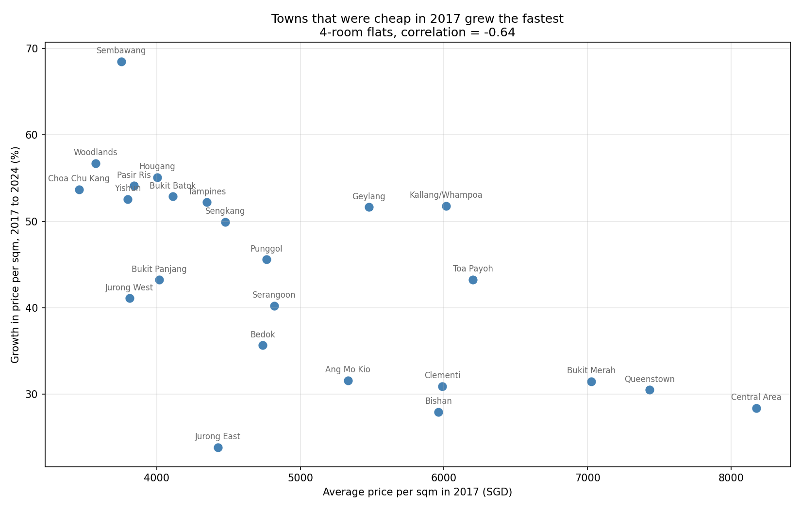

## Singapore HDB Resale Price Analysis

### Overview

216,375 HDB resale transactions, January 2017 to September 2025, from data.gov.sg.

The project answers four questions a buyer would actually ask:

1. Which towns are the most and least expensive?
2. Does a higher floor actually cost more?
3. Is there really a price cliff once the remaining lease drops below 60 years?
4. Has the gap between towns changed since 2017?

**The first version of this analysis got question 2 wrong**, and fixing it changed how I did
the rest. That story is in the *Method* section below — it is the part of the project I would
want to talk about.

### Technical Implementation
* ****Language****: Python
* ****Libraries****: pandas (data manipulation), matplotlib (visualisation)
* ****Tools****: Jupyter Notebook, Power BI

### Key Findings

**1. Town — a 72% gap between the ends.**
Bukit Timah averages $769K, Yishun $447K. This one is safe to read at face value.

**2. Floor — a real premium, but about 15% per 10 floors, not 2.6x.**
My first version reported that top-floor flats (49–51) cost 2.6 times more than ground-floor
flats. That figure came from **19 sales out of 216,375, all of them in Central Area**. It was
measuring the most expensive town in Singapore through a storey label. Holding town, flat
type and year constant, an extra floor is worth about **$87 per sqm — roughly 15.7% per 10
floors**. The raw comparison overstates the effect by **53%**.

**3. Remaining lease — no cliff at 60 years.**
The common view is that prices drop sharply once the lease falls under about 60 years. Among
4-room flats sold in 2024, the line is flat through that mark, and flats with **45–50 years
left sell for more per sqm than flats with 60–75 years left**. Holding the town constant, an
extra lease year is worth **under 1% per sqm** (+0.95% at 45–60 years, +0.41% at 60–75,
+0.79% at 75–95) — and it does not accelerate below 60. The short leases sit in the oldest,
most central estates, so the town is doing the work again.

**4. Towns are converging.**
The cheapest towns in 2017 grew the fastest: Sembawang +68%, Woodlands +57%, against Central
Area +28% and Bishan +28%. The correlation between a town's 2017 price level and its later
growth is **−0.64**. The ranking barely moved, but the gap between the most and least
expensive town narrowed from **2.36x to 1.97x**.

### Method

All three of the interesting findings are the same problem: a difference that looks like it
belongs to one variable actually belongs to the town.

To separate them I compare each sale against the average of its own group (town, flat type
and year) rather than against the whole dataset, so what is left is the within-group
difference. It is a simple approach — a regression with all the variables at once would be
stronger — but it is enough to show that the raw storey and lease numbers are misleading, and
by how much.

I also check the sample size of every band before reporting an average from it. That is what
caught the 19-transaction storey band.

### Visualisations


Grey bars below mark storey bands with fewer than 200 sales — the averages there are not
reliable, which is where the original 2.6x came from:






### Power BI dashboard


The dashboard is in `SG_HDB_RESALE.pbix`. GitHub cannot render `.pbix` files, so the image
above is the readable version.

### Repository Structure

```
singapore-hdb-analysis/
├── Singapore_HDB_Analysis.ipynb                                  # Main analysis notebook
├── ResaleflatpricesbasedonregistrationdatefromJan2017onwards.csv # Dataset
├── images/                                                       # Charts (generated by the notebook)
├── SG_HDB_RESALE.pbix                                            # Power BI file
└── README.md                                                     # Documentation
```

### How to Run

```bash
# 1. Clone the repository
git clone https://github.com/JinWanKim98/singapore-hdb-analysis.git
cd singapore-hdb-analysis

# 2. Install dependencies
pip install pandas matplotlib jupyter

# 3. Run the notebook
jupyter notebook Singapore_HDB_Analysis.ipynb
```

Running the notebook regenerates every chart in `images/`.

### Limitations

- The comparisons hold town, flat type and year constant, but not flat model, block age or
  distance to an MRT station. Some of what is left may still belong to those.
- Comparing each sale against its own town / type / year average is a simple way to control
  for them. A regression with all the variables at once would be a stronger test.
- 2025 data stops in September, so 2025 is not used in the year-on-year comparison.
- The dataset records what flats sold for, not what they were listed at, so nothing here says
  anything about how long a flat takes to sell.
