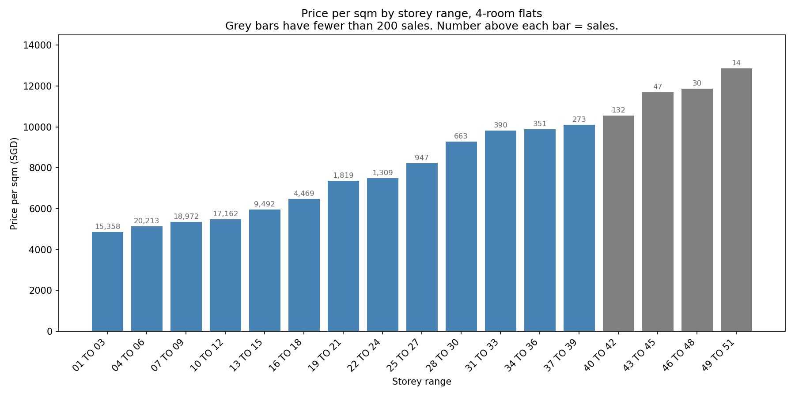
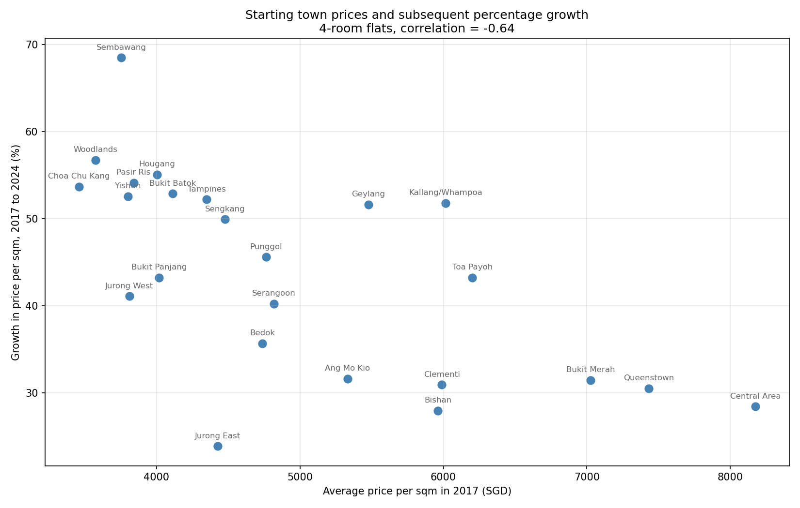

# Singapore HDB Resale Analysis

An individual exploratory analysis of **216,375 resale transactions from January 2017 to September 2025**, using Python, pandas, matplotlib and a Power BI dashboard. The questions concern town prices, storey height, remaining lease and changes since 2017.

## Tech stack

   

## Main findings

| Question | Observation | How to read it |
|---|---|---|
| Which towns cost more? | Bukit Timah has the highest mean total resale price; Yishun the lowest, a roughly 72% difference | These averages include different flat sizes/types and sale years |
| Does storey height matter? | Within town/year groups of 4-room flats, the slope is about SGD 87 per sqm per floor | A conditional association, with remaining lease and block/location details still uncontrolled |
| Is there a 60-year lease cliff? | The retained five-year bins do not show an obvious drop at 60 years | Bins and separate slopes cannot rule out or establish a discontinuity |
| Did town prices converge? | Highest/lowest town ratio falls from 2.36× to 1.97× between 2017 and 2024 | The absolute gap rises from about SGD 4,715 to SGD 5,181 per sqm |

## Checking a misleading comparison

The highest storey band contains only 19 transactions, all in Central Area. Its raw total-price ratio against the lowest band mixes storey, location and flat type. It cannot be called a floor premium.

The follow-up restricts to 4-room flats and demeans both storey midpoint and price per sqm within town/year groups. The raw slope of about SGD 132.8 falls to about SGD 87.0. The raw slope is roughly 53% larger; this is a comparison of like-for-like slopes, separate from the extreme-band ratio. Ten floors at the adjusted slope equal 15.7% of the sample mean price per sqm, not a causal percentage return on a particular flat.



## Lease and town growth

For 2024 4-room sales, the within-town lease slopes are approximately +0.95%, +0.41% and +0.79% of each band's mean price per sqm per additional lease year in the 45–60, 60–75 and 75–95 year bands. These estimates vary. They do not justify the earlier claim that the relationship does not accelerate below 60 years.

The growth comparison retains 24 towns with at least 50 sales in both 2017 and 2024. Starting price and subsequent percentage growth have a correlation near −0.64. That is a descriptive pattern; starting price also appears in the growth denominator. A lower price ratio and a larger cash gap can occur together.



## Read and run

Start with [the notebook](Singapore_HDB_Analysis.ipynb). It contains the calculations, sample counts and charts, including the distinction between relative and absolute gaps. The Power BI files and dashboard image provide a separate visual summary.

```bash
pip install -r requirements.txt
jupyter notebook Singapore_HDB_Analysis.ipynb
```

Run from the repository root using the included resale CSV. Data source: [data.gov.sg](https://data.gov.sg/), HDB resale flat prices based on registration date from January 2017 onwards; the repository is a snapshot ending September 2025.

## Limits and maintenance

Controls differ by section. Town summaries are descriptive; storey analysis compares 4-room flats within town/year; lease analysis uses 2024 4-room sales within towns. Flat model, block characteristics and MRT distance are not modelled, and uncertainty intervals are not estimated. Demeaning is a within-group regression calculation, not a substitute for all relevant covariates.

2025 is incomplete and excluded from the growth comparison. These are sale prices, with no listing prices or time-to-sale measures. The results do not establish causal premiums, recommend purchases or forecast returns. Portfolio maintenance corrected overstatements in the lease and storey interpretation and added the absolute town gap alongside the ratio.
